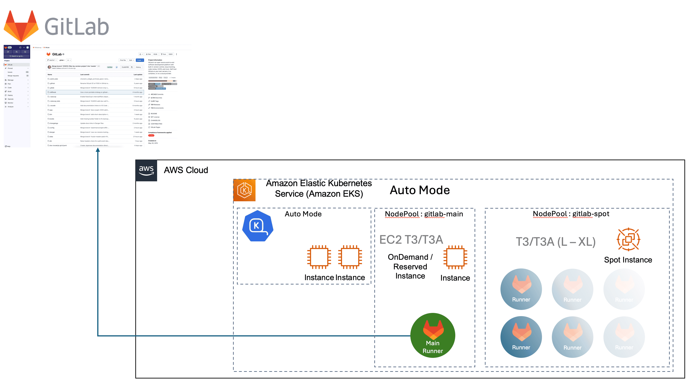

# GitLab Runner on EKS Auto-Mode

[](https://opensource.org/licenses/MIT-0)

A comprehensive solution for deploying GitLab Runners in AWS EKS Auto-Mode with proper RBAC permissions and Spot instance support. This project simplifies the management overhead of running GitLab Runners in Kubernetes by leveraging [AWS EKS Auto-Mode](https://docs.aws.amazon.com/eks/latest/userguide/automode.html).

## Problem

Managing a Kubernetes cluster when you only need to run GitLab Runners on AWS can be complex and costly.

## Solution

This project provides:

1. An automated single-script deployment on EKS in Auto-Mode with spot instances to keep costs low
2. Integration with Karpenter (Through Auto-Mode) for advanced node provisioning and scaling
3. Proper IAM configurations with OIDC provider for secure AWS resource access
4. Pre-configured and customizable RBAC rules for GitLab Runner operations (Read only)
5. Health checks and observability configurations





## Quick Start

### Prerequisites

#### Required Tools (As tested)

- **AWS CLI** v2.25.5 or newer, configured with appropriate credentials - [link](https://docs.aws.amazon.com/cli/latest/userguide/getting-started-install.html)
- **eksctl** v0.207.0 or newer (for EKS Auto-Mode support) - [link](https://eksctl.io/installation/)
- **kubectl** matching your EKS version (1.32) - [link](https://kubernetes.io/docs/tasks/tools/)
- **helm** v3.17.3 or newer - [link](https://helm.sh/docs/helm/helm_install/)
- **jq** 1.7.1 or newer
- **openssl** (for OIDC certificate processing)

#### AWS Resource Requirements

- Available VPC limit in the target region
- Available EKS cluster quota
- EC2 service limits for t-series instances
- Sufficient permissions to create IAM roles and policies

#### GitLab Requirements

- GitLab Runner registration token (you will be prompted during installation)
- Access to a GitLab instance (defaults to GitLab.com)

### Installation

1. Clone this repository:

```bash
git clone https://github.com/aws-samples/eks-auto-mode-gitlab-runner.git
cd eks-auto-mode-gitlab-runner
```

2. **CONFIGURATION**:

The configuration is split into two files:
- `configs/defaults.json` - Contains all default settings but can be modified
- `configs/custom.json` - Contains your customizations (Will be created automatically on first run)

> **⚠️ WHEN PROMPTED DURING INSTALLATION **
> 
> - Enter your GitLab Runner registration token when asked
> - You can manually edit `configs/custom.json` to update other settings like GitLab URL if using a self-hosted instance

The `custom.json` file is ignored by git to prevent committing sensitive tokens.  
> **⚠️ Do not modify the .gitignore section on this file as it would possibly expose sensitive GitLab Tokens. **

3. Install using the provided script:

```bash
chmod +x scripts/1-install-eks-auto-mode-cluster.sh
cd scripts
./1-install-eks-auto-mode-cluster.sh
```

### Handling Partial Installations

If the installation process encounters issues but the EKS cluster is successfully created, you can continue the installation using the update script. 

To verify if your EKS cluster is running:

```bash
eksctl get cluster --name <your-cluster-name>
```

If the cluster exists and is `ACTIVE`, you can proceed with the remaining installation steps:

```bash
chmod +x scripts/2-update-eks-auto-mode-cluster.sh
cd scripts
./2-update-eks-auto-mode-cluster.sh
```

The update script will:
- Apply the necessary Kubernetes configurations
- Set up the GitLab Helm repository
- Install or update the GitLab Runner components

### Update after modifying configurations

After making changes to your configuration files, use the update script to apply the changes:

```bash
chmod +x scripts/2-update-eks-auto-mode-cluster.sh
cd scripts
./2-update-eks-auto-mode-cluster.sh
```

### Cleanup

To remove all resources created by this project:

```bash
chmod +x scripts/99-cleanup.sh
cd scripts
./99-cleanup.sh
```

## Configuration Options

The solution uses two configuration files:

### defaults.json (Pre-configured values)

Most settings are defined in `configs/defaults.json` and shouldn't need modification:

| Section | Parameter | Description | Default |
|---------|-----------|-------------|---------|
| aws | region | AWS region for deployment | ca-central-1 |
| aws | tags | AWS resource tags | {"Environment": "production"} |
| eks | cluster_name | Name of the EKS cluster | eks-auto-cluster-1 |
| eks | version | Kubernetes version | 1.32 |
| iam | role_name | Name for the IAM role | gitlab-runner-eks-access-role |
| gitlab | url | GitLab URL | https://gitlab.com |
| gitlab | namespace | Kubernetes namespace for GitLab Runner | gitlab |
| gitlab | service_account | Service account name | gitlab-runner-sa |
| gitlab | concurrent_jobs | Max concurrent jobs | 10 |
| gitlab | chart_version | GitLab Runner Helm chart version | 0.55.0 |
| gitlab | resources | Resource limits and requests | See defaults.json |
| gitlab | health_check | Health check configuration | See defaults.json |

### custom.json (Your Settings)

`configs/custom.json` contains only values that need customization:

| Section | Parameter | Description | Default |
|---------|-----------|-------------|---------|
| gitlab | runner_token | GitLab Runner registration token | (You'll be prompted) |

You can override any value from defaults.json by adding it to custom.json.

## Architecture

This solution deploys:

1. An EKS cluster in Auto-Mode with managed node groups
2. Karpenter for spot instance management
3. IAM roles and policies with OIDC provider integration
4. GitLab Runner deployed via Helm with optimized configuration
5. Health checks for monitoring runner availability

## Spot Instance Configuration

GitLab Runners are configured to use AWS Spot Instances for cost-effective execution. The configuration includes:

- Instance types: c-series and t-series (compute-optimized and general-purpose)
- Multiple instance sizes for better spot availability
- Node termination handling for graceful job migration

## Advanced Features

- **Health Checks**: Configured liveness and readiness probes
- **Resource Limits**: Controlled resource allocation to prevent cluster resource exhaustion
- **IAM Integration**: Secure access to AWS resources through OIDC provider
- **Cost Optimization**: Spot instances with proper termination handling


## Solution Cost

### Infrastructure Cost Components

Below is a monthly cost estimate (730 hours) for the base infrastructure required. This represents a production-ready setup with high availability.

| Component | Configuration | Monthly Cost (USD) | Calculation |
|-----------|--------------|-------------|-------------|
| EKS Cluster | 1 cluster | $73.00 | 730 hours × $0.10 |
| EC2 Instance | 1 × t3a.medium (on-demand) | $27.45 | 730 hours × $0.0376 |
| EBS Storage | 20GB gp3 volume | $1.60 | 20GB × $0.08 |
| NAT Gateway | 1 gateway + data processing | $32.90 | 730 hours × $0.045 + minimal data cost |
| VPC Endpoint | 1 endpoint (optional) | $7.30 | 730 hours × $0.01 |
| Network Traffic | Base outbound transfer | $0.36 | 4GB × $0.09 (after free tier) |
| CloudWatch Logs | Basic monitoring | $0.53 | $0.50/GB ingestion + $0.03/GB storage |
| **Base Infrastructure Total** | | **~$143.14** | |

### Build Workload Cost (Typical Usage)

This additional cost represents the dynamically provisioned spot instances for actual CI/CD workloads:

| Component | Configuration | Monthly Cost (USD) | Calculation |
|-----------|--------------|-------------|-------------|
| Spot Instances | t3a.xlarge for 20 hours/month | $0.90 | 20 hours × $0.0451 |
| EBS Storage | 20GB for spot instances (prorated) | $0.04 | 20GB × $0.08 × (20/730) |
| Network Traffic | 50GB outbound from builds | $4.50 | 50GB × $0.09 |
| **Build Workload Total** | | **~$5.44** | |

**Combined Total (Infrastructure + Builds): ~$148.58 per month**

#### Potential Cost Optimizations

1. **VPC**: Use an existing VPC that has access to a nat gateway, saving ~$33/month
2. **Cluster Reservation**: With long-term usage, consider Savings Plans or Reserved Instances
3. **Region Selection**: Costs vary by region; select based on both latency and cost considerations
4. **Instance Types**: Mix of instance types in the spot pool increases availability and may reduce costs

For ephemeral workloads, you may consider destroying the cluster when not in use to minimize costs.

> **Note:** All prices are approximate and may vary by region and over time. For current pricing, please refer to the [AWS pricing page](https://aws.amazon.com/pricing/). The estimate above is for reference and assumes minimal workload.


## Contributing

Contributions are welcome! Please see [CONTRIBUTING.md](CONTRIBUTING.md) for details.

## License

This project is licensed under the MIT-0 License - see the [LICENSE](LICENSE) file for details.